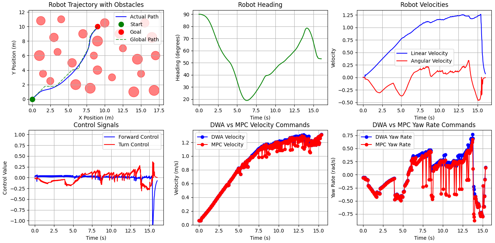

<div align="center">

# 🤖 Motion Planning for Differential Drive Robots
### Tri-Layer Navigation — A* Global Planning · DWA Local Optimization · MPC Trajectory Control

[](https://www.python.org/)
[](https://mujoco.org/)
[](https://numpy.org/)
[](https://scipy.org/)
[](https://matplotlib.org/)
[]()
[](LICENSE)

<br>

> *"Motion planning is the bridge between perception and action — knowing where you are is not enough; knowing how to get where you need to be, safely and efficiently, is what separates a capable robot from a stationary one. This system masters that bridge through three tightly integrated layers of intelligence."*

<br>

**Institution:** ITMO University — Faculty of Control Systems and Robotics <br>
**Program:** MSc Robotics and Artificial Intelligence <br>
**Simulation Engine:** MuJoCo Physics Simulator

</div>

---

## 📋 Table of Contents

- [📖 Introduction](#-introduction)
- [✨ Key Features](#-key-features)
- [🏗️ System Architecture](#️-system-architecture)
- [⚙️ Algorithms Implemented](#️-algorithms-implemented)
- [🚀 Installation](#-installation)
- [📂 Project Structure](#-project-structure)
- [▶️ Usage](#️-usage)
- [🔧 Implemented Functions](#-implemented-functions)
- [📊 Examples of Work](#-examples-of-work)
- [🎨 Design Patterns and Principles](#-design-patterns-and-principles)
- [🧰 Tech Stack](#-tech-stack)
- [🤝 Contributing](#-contributing)
- [🙏 Acknowledgment](#-acknowledgment)

---

## 📖 Introduction

Motion planning involves computing the state sequence for a robot to move from start to goal without conflicts. This repository implements a comprehensive motion planning system combining:

- **Path Planning** — Computes optimal collision-free paths considering obstacles
- **Trajectory Planning** — Generates motion states based on kinematics and dynamics constraints
- **Control** — Executes planned trajectories using advanced controllers

The system uses a **hierarchical tri-layer approach**:

```
  Layer 1 — Global          Layer 2 — Local           Layer 3 — Execution
  ─────────────────         ──────────────────         ──────────────────
  ┌─────────────┐           ┌──────────────┐           ┌───────────────┐
  │   A* Path   │──────────►│  DWA Local   │──────────►│  MPC Precise  │
  │   Planner   │  global   │  Trajectory  │  local    │  Trajectory   │──► Robot
  │             │  path     │  Optimizer   │  traj.    │  Follower     │
  └─────────────┘           └──────────────┘           └───────┬───────┘
                                                               │
                                                               ▼
                                                      ┌────────────────┐
                                                      │  PID Low-Level │
                                                      │  Motor Control │
                                                      └────────────────┘
```

1. **Global path planning** with A* algorithm
2. **Local trajectory optimization** with Dynamic Window Approach (DWA)
3. **Model Predictive Control (MPC)** for precise trajectory following
4. **PID** for low-level motor control

---

## ✨ Key Features

<div align="center">

| 🧩 Feature | 📋 Description |
|:----------:|:--------------|
| 🏛️ **Modular Architecture** | SOLID-compliant design with clear separation of concerns |
| 🗺️ **Multiple Planning Strategies** | Combines global A* with local DWA and MPC |
| 🚧 **Collision Avoidance** | Real-time obstacle detection and avoidance |
| 📊 **Visualization** | Comprehensive trajectory visualization and performance metrics |
| 🎛️ **Smooth Control** | PID controller with velocity filtering for smooth operation |

</div>

---

## 🏗️ System Architecture

```
┌─────────────────────────────────────────────────────────────────────┐
│                       TRINAV SYSTEM OVERVIEW                        │
└─────────────────────────────────────────────────────────────────────┘

  ┌──────────┐     ┌──────────┐     ┌──────────┐     ┌──────────┐
  │  Config  │     │ A* Global│     │   DWA    │     │   MPC    │
  │  Params  │────►│ Planner  │────►│  Local   │────►│Controller│
  └──────────┘     └──────────┘     │ Planner  │     └────┬─────┘
                                    └──────────┘          │
  ┌──────────┐                                            │
  │  MuJoCo  │◄───────────────────────────────────────────┘
  │ Simulator│     ┌──────────┐     ┌──────────┐
  └────┬─────┘────►│   PID    │────►│ Velocity │
       │           │Controller│     │ Filtering│
       │           └──────────┘     └──────────┘
       ▼
  ┌──────────┐
  │Visualizer│
  └──────────┘
```

---

## ⚙️ Algorithms Implemented

<div align="center">

| 🗂️ Category | 🧠 Algorithm | 📋 Description | ✅ Status |
|:-----------:|:-----------:|:-------------:|:--------:|
| Global Planning | **A\*** | Grid-based optimal path search with obstacle inflation | ✅ Complete |
| Local Planning | **DWA** | Dynamic Window Approach — velocity-space trajectory sampling | ✅ Complete |
| Trajectory Opt. | **MPC** | Model Predictive Control — receding horizon optimisation | ✅ Complete |
| Low-Level Control | **PID** | Proportional-Integral-Derivative velocity tracking | ✅ Complete |

</div>

---

## 🚀 Installation

### Prerequisites

- Python 3.10+
- MuJoCo 3.3.2

### Option 1 — Using pip

```bash
pip install numpy scipy matplotlib mujoco
```

### Option 2 — From Source

```bash
git clone https://github.com/yourusername/differential-drive-motion-planning.git
cd differential-drive-motion-planning
pip install -r requirements.txt
```

---

## 📂 Project Structure

```
📦 differential-drive-motion-planning/
│
├── 📁 models/                       # Robot models and environments
│   └── 🤖 ddr.xml                   # Differential drive robot MuJoCo model
│
├── 📁 src/                          # Main source code
│   ├── 📁 config/                   # Configuration parameters
│   │   └── 📄 params.py             # Simulation parameters
│   │
│   ├── 📁 control/                  # Control algorithms
│   │   ├── 📄 motion_controller.py  # MPC controller
│   │   └── 📄 pid_controller.py     # PID controller
│   │
│   ├── 📁 models/                   # Data models
│   │   ├── 📄 environment.py        # Environment representation
│   │   └── 📄 vehicle_state.py      # Vehicle state model
│   │
│   ├── 📁 planning/                 # Planning algorithms
│   │   ├── 📄 global_planner.py     # A* path planner
│   │   └── 📄 local_planner.py      # DWA trajectory planner
│   │
│   ├── 📁 simulator/                # Simulation components
│   │   ├── 📄 base_simulator.py     # Simulator interface
│   │   └── 📄 mujoco_simulator.py   # MuJoCo implementation
│   │
│   ├── 📁 utils/                    # Utility functions
│   │   ├── 📄 geometry.py           # Geometry calculations
│   │   └── 📄 visualization.py      # Visualization tools
│   │
│   └── 📄 main.py                   # Main entry point
│
├── 📄 requirements.txt              # Python dependencies
└── 📄 README.md                     # This document
```

---

## ▶️ Usage

### Basic Simulation

```bash
python src/main.py
```

### Customizing Parameters

Modify `src/config/params.py` to:
- Change start/goal positions
- Adjust obstacle configurations
- Tune planning and control parameters

### Example Configuration

```python
# In src/config/params.py
start_pos = [0, 0]           # Starting position [x, y]
goal_pos = [15, 12]          # Goal position [x, y]
obstacles = [                # List of obstacles [x, y, radius]
    [1.2, 10.8, 0.6],
    [16.8, 1.2, 0.7],
    # ... add more obstacles
]
max_speed = 4.0              # Maximum robot speed (m/s)
```

---

## 🔧 Implemented Functions

### 🗺️ Planning

- **A\* Global Planner** — Computes optimal path using grid-based search
- **Dynamic Window Approach** — Local trajectory optimization with obstacle avoidance
- **Path Simplification** — Reduces path complexity while maintaining safety

### 🎛️ Control

- **Model Predictive Control** — Optimizes trajectory following
- **PID Controller** — Executes velocity commands with smooth transitions
- **Recovery Behaviors** — Handles dead-end situations

### 🔬 Simulation

- **MuJoCo Integration** — Realistic physics simulation
- **Collision Detection** — Continuous collision checking
- **State Estimation** — Accurate pose and velocity tracking

### 📊 Visualization

- **Live Trajectory Plotting** — Real-time path visualization
- **Performance Metrics** — Path length, average speed, computation time
- **Command Comparison** — DWA vs MPC commands visualization

---

## 📊 Examples of Work

### Navigation Through Obstacles


---

### Performance Metrics


---

### Control Signals



---

## 🎨 Design Patterns and Principles

### SOLID Principles

<div align="center">

| 🔤 Principle | 📋 Description | 🛠️ Applied As |
|:-----------:|:--------------|:-------------:|
| **S** — Single Responsibility | Each class has a single purpose | One class per planner, controller, simulator |
| **O** — Open/Closed | Extensible through interfaces and inheritance | Abstract base classes for planners and controllers |
| **L** — Liskov Substitution | Interchangeable components | Swappable planner and controller implementations |
| **I** — Interface Segregation | Focused, minimal interfaces | Separate interfaces for planning, control, simulation |
| **D** — Dependency Inversion | High-level modules depend on abstractions | Config injection, abstract simulator base |

</div>

### Design Patterns

<div align="center">

| 🧩 Pattern | 🎯 Applied To |
|:---------:|:-------------:|
| **Strategy** | Interchangeable planning and control algorithms |
| **Factory** | Creates different planner types |
| **Observer** | Visualization updates on state changes |
| **Facade** | Simplified interfaces for complex subsystems |

</div>

---

## 🧰 Tech Stack

<div align="center">

| 🛠️ Tool | 🔖 Version | 🎯 Role |
|:-------:|:---------:|:-------:|
|  | 3.10+ | Core language — all planning, control, and simulation logic |
|  | 3.3.2 | Physics simulation engine — realistic differential drive dynamics |
|  | Required | Array operations, state vectors, trajectory arrays |
|  | Required | Rotation transforms (`scipy.spatial.transform`), optimisation |
|  | Required | Live trajectory plots, performance metrics, DWA vs MPC command comparison |

</div>

---

## 🤝 Contributing

Contributions are welcome! Please follow these steps:

1. Fork the repository
2. Create a new branch
   ```bash
   git checkout -b feature/your-feature
   ```
3. Commit your changes
   ```bash
   git commit -am 'Add some feature'
   ```
4. Push to the branch
   ```bash
   git push origin feature/your-feature
   ```
5. Create a **Pull Request**

---

## 🙏 Acknowledgment

This project references and builds upon concepts from:

- [Python Motion Planning](https://github.com/zhm-real/PathPlanning) — Path planning reference implementations
- [MuJoCo Physics Simulator](https://mujoco.org/) — Physics simulation engine
- [Dynamic Window Approach](https://www.ri.cmu.edu/pub_files/pub1/fox_dieter_1997_1/fox_dieter_1997_1.pdf) — Fox et al., CMU Robotics Institute
- [Model Predictive Control](https://arxiv.org/abs/1705.02789) — MPC for robot navigation

---

<div align="center">

*Motion Planning for Differential Drive Robots — MSc Robotics and Artificial Intelligence | ITMO University*

⭐ *If this implementation helped you understand hierarchical motion planning, DWA, MPC, or MuJoCo simulation, consider giving it a star!* ⭐

</div>
